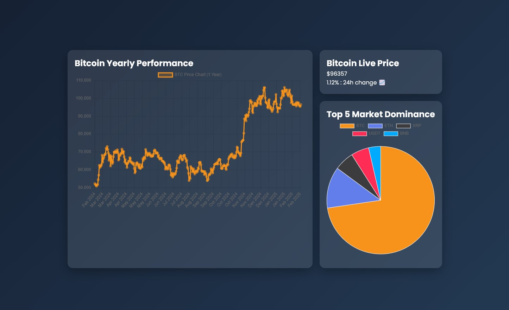
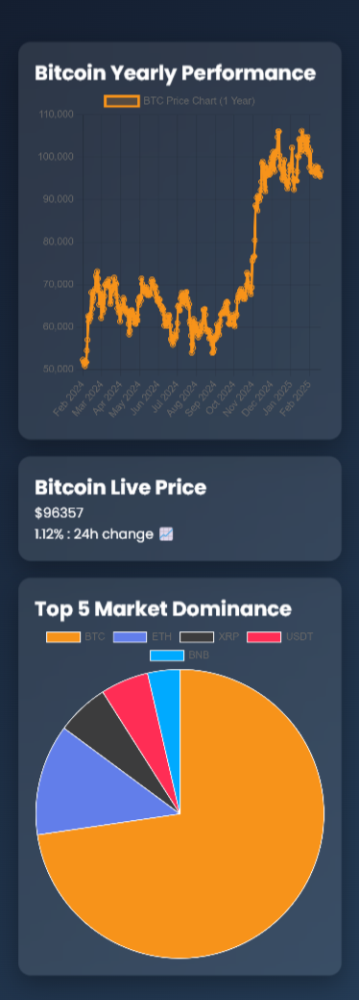

# 🚀 Crypto Dashboard

Crypto dashboard is a modern and visually appealing crypto dashboard that provides real-time market insights. It includes:

✅ **Live Bitcoin Price Display**  
✅ **One-Year Bitcoin Price Change Chart**  
✅ **Top 5 Crypto Market Dominance Pie Chart**  

## 📊 Technologies Used
- **React.js ⚛️**
- **Chart.js 📈**
- **CSS Flexbox & Grid 🎨**
- **Fetch API 🔄**

## 📌 Features
- **Live Data Fetching** using free APIs  
- **Fully Responsive** (Optimized for both desktop and mobile)  
- **Built with React.js and Chart.js** for high-performance data visualization  

## 📸 Screenshots  
### 🖥 Desktop View  
  

### 📱 Mobile View  
  

## 🛠 Installation & Setup

```bash
git clone https://github.com/omidbeheshtian/Crypto-Dashboard.git
cd Crypto-Dashboard
npm install
npm start

## 📄 License
This project is licensed under the MIT License.
